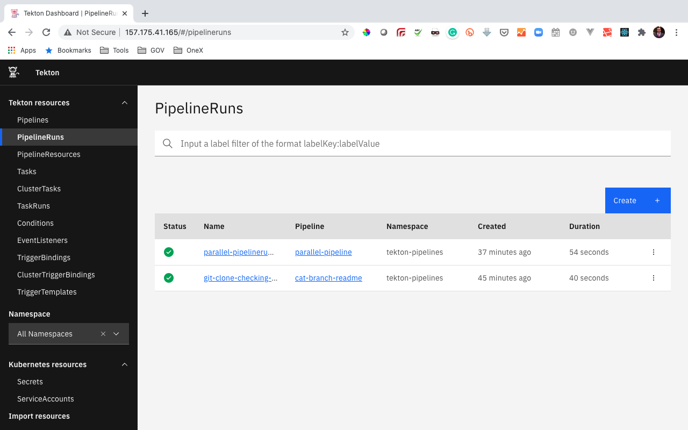
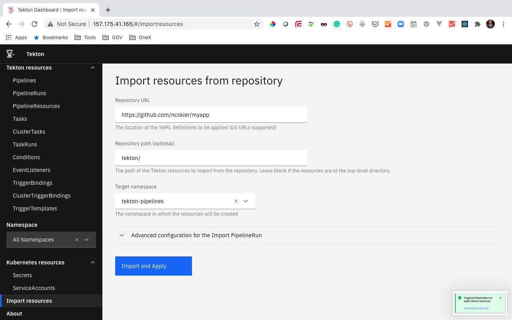
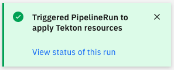
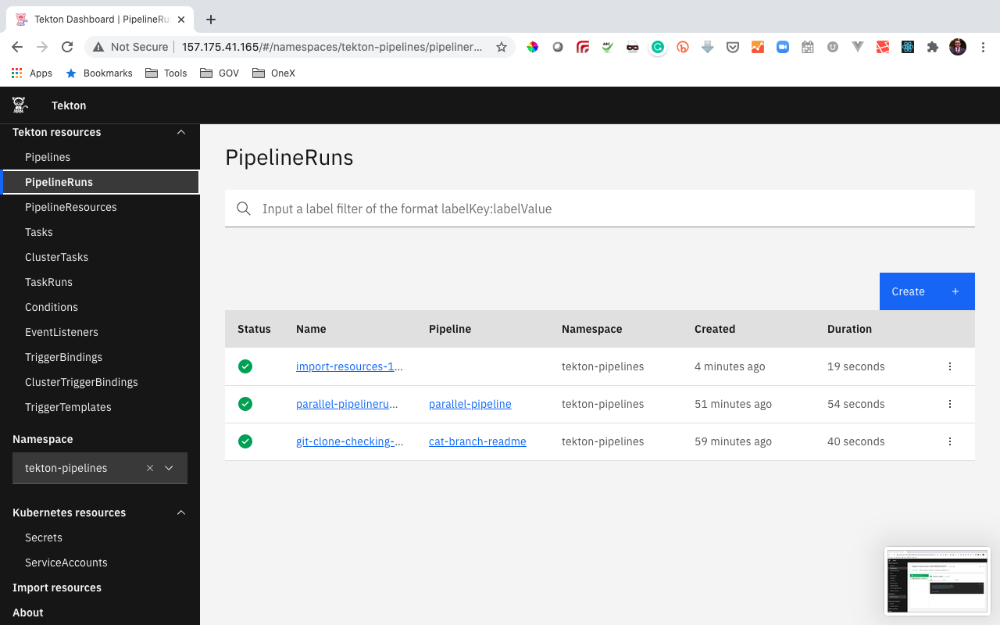
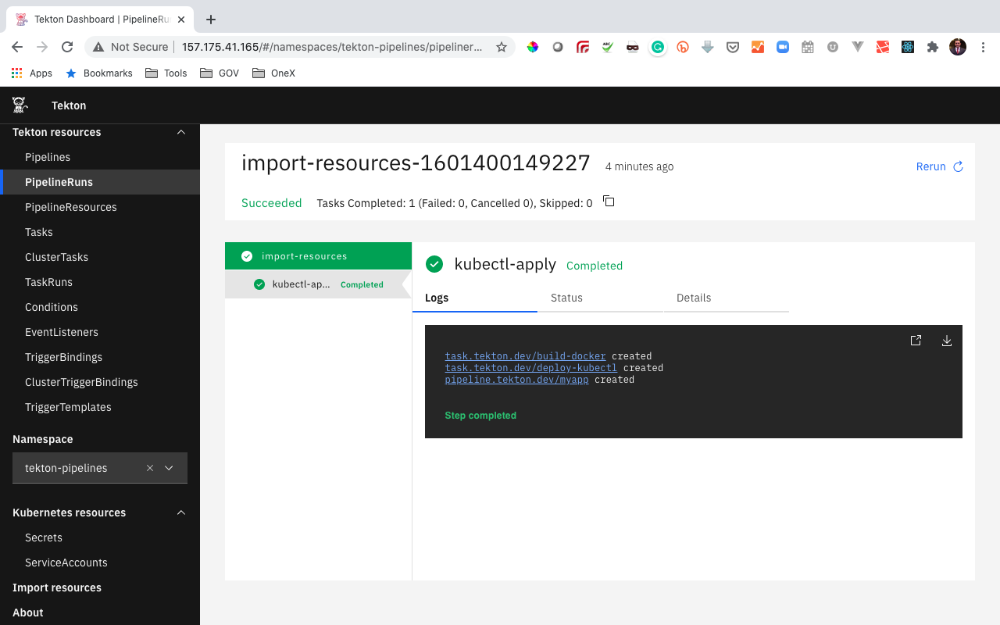

# Tekton Dashboard

## Install the Tekton Dashboard Prerequisites

1. Tekton Triggers (Optional)

For reference, the installation instructions are [here](https://github.com/tektoncd/dashboard#install-dashboard). To install the Tekton Dashboard, run the following command:

`kubectl apply --filename https://storage.googleapis.com/tekton-releases/dashboard/latest/tekton-dashboard-release.yaml`

Verify the ingress controller pod is running:

`kubectl get pods -n ingress-nginx`

Create Ingress for the Tekton Dashboard

View the Tekton Dashboard Service: `kubectl get svc tekton-dashboard -n tekton-pipelines`

The Tekton Dashboard Service is exposed on port 9097. So, create an Ingress for the tekton-dashboard Service on port 9097:

```bash
cat << EOF | kubectl apply -f -
apiVersion: networking.k8s.io/v1beta1
kind: Ingress
metadata:
  name: tekton-dashboard
  namespace: tekton-pipelines
spec:
  backend:
    serviceName: tekton-dashboard
    servicePort: 9097
EOF
```

Verify the Ingress was created: `kubectl get ingress -n tekton-pipelines`

Open the Dashboard by entering public IP of your lab machine in the browser. You will see a dashboard similar to this



Navigate to the __Import Resources__ page in the Dashboard. We want to import the Tekton resources that are defined in the `tekton/` directory of `MyApp`. Import these Tekton resources into the default Namespace by filling in the form with the following information:

Repository URL: `https://github.com/ncskier/myapp`

Namespace: `tekton-pipelines`

Repository directory: `tekton/`

Service Account `tekton-dashboard`

The form should look like the following:



Click `Import and Apply` and you'll see a success message like following 



If you click on the __`PipelineRuns`__ link in the dashboard you'll notice an entry for the imported pipeline



and the details of the imported pipeline when you click on it's link



You can similarly create `Tasks`, `Pipelines` and `PipelineRuns` and view running application on deployment to the kube cluster.